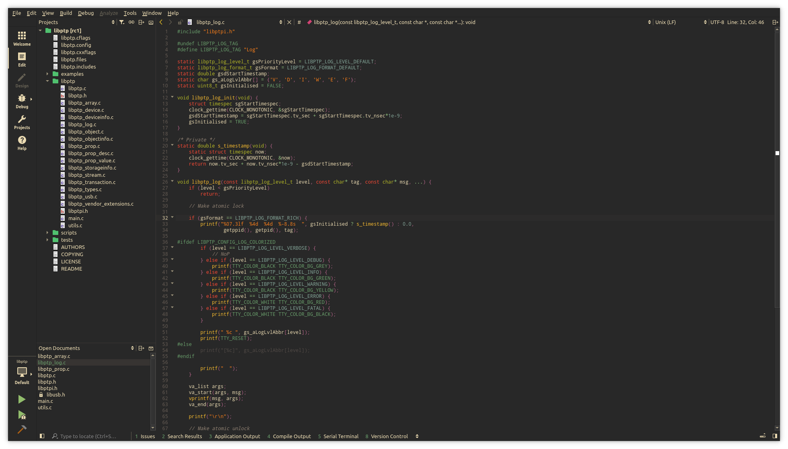
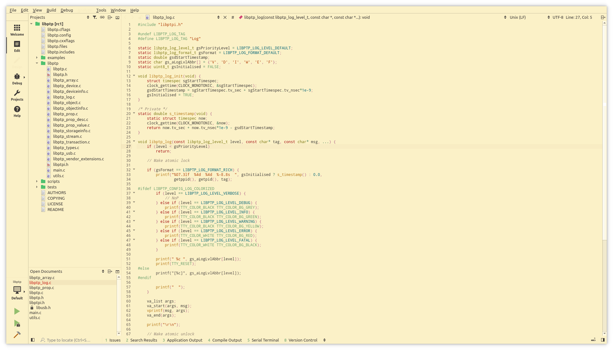
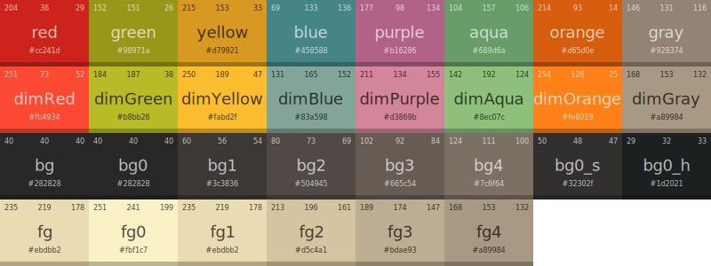
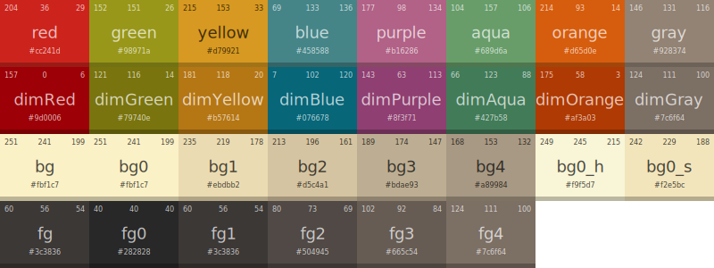
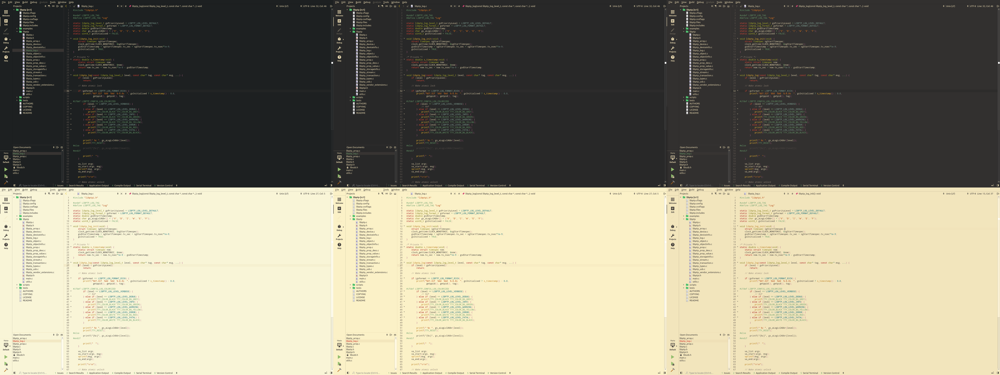

# Gruvbox Theme for QtCreator

This project is adaptation of [gruvbox](https://github.com/morhetz/gruvbox) authored by [@morhetz](https://github.com/morhetz) for QtCreator IDE.

## Screenshots

### Dark mode

### Light mode

## Palette

### Dark mode

### Light mode

## Contrast options

## Installation

1. Copy files from `theme` folder to `/usr/share/qtcreator/themes`:
1. Install files from `styles` folder to `/usr/share/qtcreator/styles`.

## Inspirations

- https://github.com/morhetz/gruvbox

## License

[MIT License](https://github.com/sainnhe/gruvbox-material-vscode/blob/master/LICENSE)
